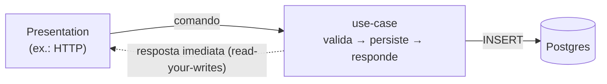
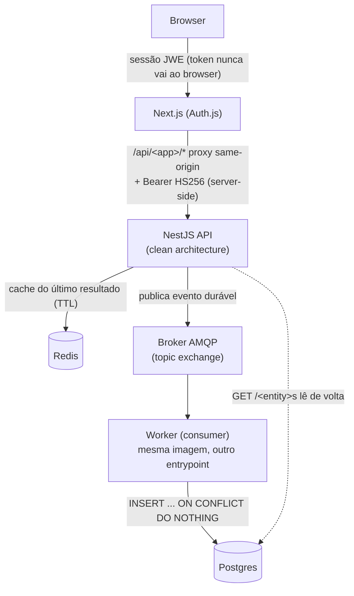
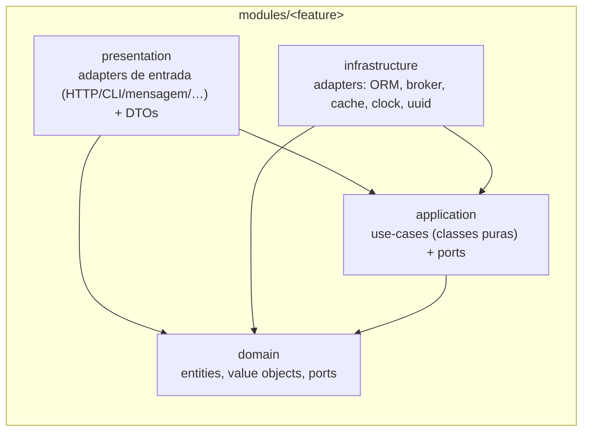

# Arquitetura

> **Estilo Diátaxis — explanation.** Esta página explica o **porquê** das
> escolhas estruturais. Não é um passo-a-passo (veja
> [Replicar este harness](../how-to/replicate-this-harness.md)) nem uma
> referência de API. Domínio neutralizado: `<App>` é o produto, `<Feature>` é um
> bounded context (módulo), `<Entity>` é o agregado que ele manipula,
> `<Presentation>` é uma borda de entrada (ex.: web + API (proxy same-origin), CLI, API pública).

## Postura arquitetural

Antes de qualquer diagrama, três posições canônicas — todo o resto desta página
é a aplicação delas. **Princípio primeiro; a forma concreta deste harness é um
exemplo, não a verdade.**

1. **Múltiplas presentations sobre um core.** O coração é uma **API
   monólito-modular** (clean architecture). Ela é servida a **uma ou mais**
   presentations — web, mobile, CLI, API pública, integrações/webhooks — e cada
   presentation é um **adapter de borda fino**. A `presentation` de um módulo é
   **uma borda** (HTTP é um exemplo; CLI, gRPC, GraphQL e consumidor de fila são
   outras). **Invariante de auth:** o core verifica um **token assinado** e
   autoriza pelo **escopo do claim**, **nunca** pelo input; cada presentation tem
   seu próprio fluxo de credencial.
2. **Síncrono por default; CQRS/assíncrono só sob NFR.** O write padrão é
   `use-case valida → persiste → responde`. Separar o write do persist (publicar
   evento → worker idempotente → read model) é **CQRS/write-behind** e se adota
   **só sob um NFR concreto** (assimetria leitura/escrita, escala de leitura,
   picos, desacoplamento, fan-out). O custo (broker + idempotência +
   read-your-writes eventual) **vira ADR**. O assíncrono é uma **variante**, não
   "o jeito".
3. **Monólito modular por default.** Extrair um módulo para serviço só com razão
   concreta (NFR), nunca por estética. "Extrair depois" é um refactor **planejado
   e documentado em ADR**.

> Este harness **demonstra** a forma web + API (proxy same-origin) na **variante assíncrona** porque é
> a mais rica de ensinar (mostra broker, worker e idempotência num só loop). Não
> confunda a demonstração com a regra: a regra é o default síncrono e a presença
> de N presentations possíveis.

## A presentation é plural

A `presentation` de um módulo é a **borda de entrada** que adapta um protocolo ao
mesmo use-case — e há **muitas** bordas possíveis para o **mesmo** núcleo:

| Borda (presentation) | Como aciona o use-case | Fluxo de credencial |
|---|---|---|
| Web + API (proxy same-origin, HTTP) | controller HTTP → use-case | cookie de sessão → JWT de API server-side (exemplo deste harness) |
| CLI / job | comando lê args → use-case | token de serviço / credencial de máquina |
| Consumidor de fila | handler de mensagem → use-case | claim no envelope, verificado pelo core |
| API pública / integração | controller HTTP versionado → use-case | API key trocada por token assinado |
| Webhook | endpoint de recepção → use-case | assinatura HMAC do emissor |

O comum a todas: a borda **só traduz** (protocolo → input do use-case → DTO de
saída); a regra de negócio e a autorização (escopo do claim verificado) vivem no
core, **iguais** em todas as bordas. Controllers HTTP são **um** tipo de
presentation; este harness materializa a borda web + API (proxy same-origin) e deixa as demais como
adapters adicionais que reusam o mesmo use-case.

## Síncrono por default, assíncrono por NFR (CQRS quando justificado)

O **caminho de escrita padrão é síncrono**: o use-case valida, **persiste** e
responde na mesma requisição. Simples, com read-your-writes imediato e sem
broker.



A **variante assíncrona (CQRS/write-behind)** abaixo separa write-path de
persist-path — adote-a **só sob NFR** (ver
[Escrita síncrona — e o opt-in assíncrono](sync-and-async-flow.md)). O diagrama
de visão geral a seguir é **exemplo dessa variante**, na borda **web + API (proxy same-origin)**.

> **Exemplo: variante assíncrona + presentation web + API (proxy same-origin).**



O ponto não-óbvio **desta variante**: a API não persiste no write-path. Ela faz o
trabalho barato (validar, gerar id, cachear, publicar) e responde na hora; a
escrita durável é assíncrona, no worker. Isso é **CQRS/write-behind** e só se
justifica sob NFR — veja
[Escrita síncrona — e o opt-in assíncrono](sync-and-async-flow.md) para o detalhe
e o porquê. No default síncrono, esse mesmo POST persistiria e responderia na
hora (diagrama síncrono acima).

> **Específico do adapter web + API (proxy same-origin).** A sessão JWE (cookie cifrado) e o Bearer
> HS256 **server-side** (token nunca vai ao browser) são o **fluxo de credencial
> desta presentation**, não uma propriedade do core. Outras presentations (CLI,
> API pública, fila) têm seu próprio fluxo; o que o core exige é sempre o mesmo:
> um **token assinado** cujo **escopo do claim** ele verifica. Detalhe da
> "Arquitetura A" (dois segredos) em
> [Replicar este harness](../how-to/replicate-this-harness.md).

## Monólito modular + Clean Architecture (API)

O backend é um **monólito modular**: um único deploy, mas fronteiras lógicas
nítidas. Cada bounded context (ex.: `<Feature>`) é um módulo com **quatro
camadas concêntricas** e a **regra de dependência apontando para dentro**.



- **domain** — entidades, value objects, *ports* de domínio. **Sem framework**
  (verificável por grep: zero imports de `@nestjs/*` em `domain/`). Invariantes
  vivem aqui: `Entity.create(props)` (factory + construtor privado),
  `ValueObject.create(raw)` (lança se inválido).
- **application** — use-cases **puros**, dependem só de *ports* injetadas pelo
  construtor. Sem decorators Nest → testáveis por construção direta
  (`new UseCase(fakePort, ...)`), sem `TestingModule`.
- **infrastructure** — *adapters* concretos (Drizzle, broker, Redis, clock).
  ORM/linhas de banco ficam **confinados** aqui; um *mapper* traduz
  row ↔ agregado na fronteira.
- **presentation** — **adapters de entrada (ex.: HTTP)** finos + DTOs (API First
  / OpenAPI). O adapter só traduz protocolo→use-case e use-case→DTO; lógica nova
  de negócio **nunca** entra nele. HTTP é **um** tipo — o mesmo use-case pode ser
  exercido por uma CLI, um consumidor de fila, uma API pública ou um webhook (ver
  "A presentation é plural" acima). Lá onde há HTTP, vale API First / OpenAPI.

### Ports são abstract classes, não interfaces

Um *port* é declarado como `abstract class` porque serve **dois papéis ao mesmo
tempo**: contrato de tipo em compile-time **e** token de DI em runtime
(interfaces somem ao compilar e não podem ser token).

```ts
// application/ports/clock.port.ts
export abstract class ClockPort {
  abstract now(): Date;
}

// infrastructure/adapters/system-clock.ts
export class SystemClock extends ClockPort {
  now(): Date {
    return new Date();
  }
}
```

### O composition root é o único lugar que conhece adapters

Todo `provide / useClass / useFactory` mora no `<feature>.module.ts`. Nenhuma
camada se auto-liga. Use-cases puros são instanciados por `useFactory + inject`,
o que mantém o núcleo agnóstico de Nest:

```ts
@Module({
  providers: [
    { provide: ClockPort, useClass: SystemClock },
    {
      provide: SendEventUseCase,
      inject: [EventPublisherPort, ClockPort, IdGeneratorPort],
      useFactory: (publisher, clock, ids) =>
        new SendEventUseCase(publisher, clock, ids),
    },
  ],
})
export class FeatureModule {}
```

**Por que isso importa.** Trocar uma implementação (in-memory → Drizzle,
regex → LLM) é só um novo adapter + rebind no módulo — sem tocar use-case ou
domínio. O custo consciente: o composition root cresce; é o preço de manter o
núcleo puro com toda a fiação concentrada num lugar.

## Monólito modular: 1 deploy, fronteiras lógicas

Cada feature é um módulo independente importado no `app.module.ts`. Não há rede
entre módulos — é um processo só — mas a disciplina de camadas garante que, se
um dia um módulo precisar virar serviço, a fronteira já existe. "Extrair depois"
é um refactor **planejado e documentado em ADR**, não um TODO solto.

## Determinístico primeiro, IA/LLM depois (atrás de um port)

O caminho crítico funciona **sem LLM**: o use-case decide o dado de forma
determinística. Quando um LLM entra (numa fatia posterior), ele entra **atrás de
um port** e só "explica/organiza" a saída — nunca "decide". Isso mantém o CI
*keyless*, reproduzível e barato, e torna a troca de provider (ou a remoção do
LLM) uma questão de rebind no módulo.

## Observabilidade e config (cross-cutting)

- **OTel** é pré-carregado via `--require ./dist/otel.js` antes do framework, é
  *best-effort* (no-op quando o endpoint OTLP está vazio, *swallow* de todos os
  erros) e **nunca derruba o boot**. Por ser pré-carregado, o trace propaga
  produtor → broker → consumidor automaticamente.
- **Config** é validada por zod no boot (`config/env.schema.ts`); env inválida
  falha rápido.

## Links

- Decisão de adotar ADRs: [ADR-0001](../adr/0001-record-architecture-decisions.md)
- O fluxo de escrita (síncrono por default; assíncrono sob NFR):
  [Escrita síncrona — e o opt-in assíncrono](sync-and-async-flow.md)
- Bootstrap passo-a-passo: [Replicar este harness](../how-to/replicate-this-harness.md)
