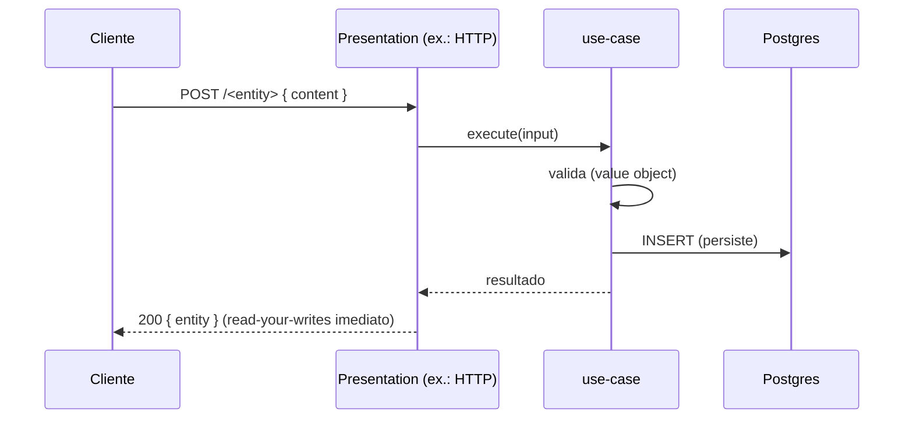
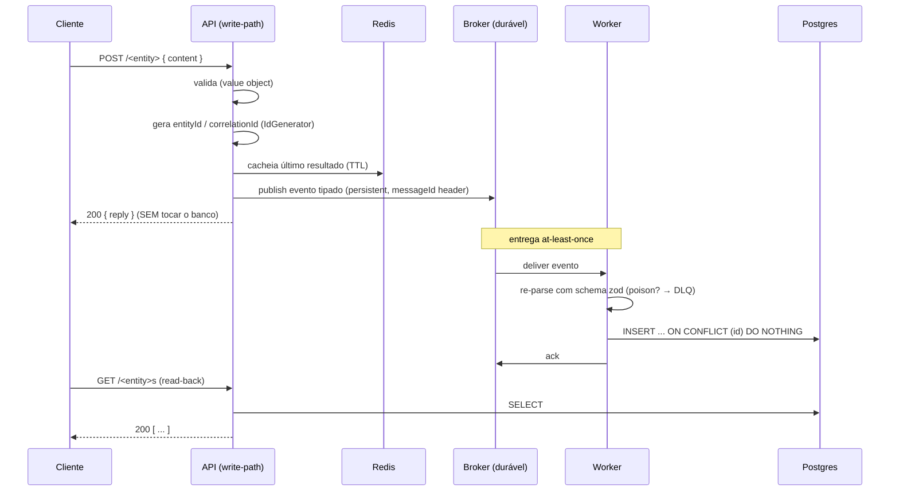
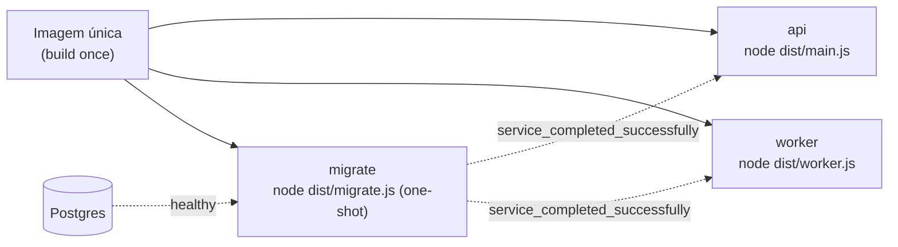

# Escrita síncrona — e o opt-in assíncrono (CQRS) quando o NFR justifica

> **Estilo Diátaxis — explanation.** O write padrão é síncrono
> (`valida → persiste → responde`); por que e quando separar write-path de
> persist-path numa variante assíncrona, e como o worker grava depois de forma
> idempotente. Domínio neutro: `<App>` publica um evento `<entity>Received`; o
> worker persiste em `<entity>s`.

## Quando aplicar (decisão de NFR) — e o default síncrono

**O default é síncrono.** Sem um gatilho de NFR, o handler do comando
**valida → persiste → responde** na mesma requisição: simples, com
read-your-writes imediato, sem broker nem worker.



A variante deste documento — write-path responde **sem persistir** e um worker
grava depois — é **CQRS/write-behind**. Ela tem custo (broker + idempotência +
consistência eventual no read-back) e por isso é **opt-in sob NFR concreto**.
**Adote-a só quando** um destes pesar:

- **Assimetria leitura/escrita** — leituras dominam e querem um read model
  próprio.
- **Escala de leitura** — read model separado/replicável sem onerar o write.
- **Picos / absorção de carga** — a fila durável amortece rajadas; o POST não
  espera o banco.
- **Desacoplamento da disponibilidade do banco** — se o Postgres está lento, o
  POST ainda responde; o evento espera na fila.
- **Fan-out** — vários consumidores reagem ao mesmo evento.

**Sem** esses gatilhos, fique no caminho síncrono. A separação write/persist
(este CQRS) é uma decisão arquitetural e **vira ADR** — registre o NFR que a
justifica e o custo aceito (próxima seção).

## (Variante assíncrona) O princípio: separar write-path de persist-path

Na variante assíncrona, o handler síncrono do POST **não escreve no banco de
domínio**. Ele faz só o trabalho barato/rápido — validar, gerar ids, montar o
evento, cachear o último resultado para follow-ups — e **publica um evento**. A
escrita durável é responsabilidade **assíncrona** do worker.

**Por quê:** mantém a latência do POST baixa e desacopla o produtor da
disponibilidade do banco (um dos NFRs acima). Se o Postgres estiver lento, o POST
ainda responde; o evento espera na fila durável.

> **Custo assumido: consistência eventual no read-back.** Como a persistência é
> assíncrona, um `GET /<entity>s` logo após o POST **pode** não ver o registro
> ainda (a fila não drenou). Você troca read-your-writes imediato por latência
> baixa e desacoplamento — é exatamente o NFR que justifica o CQRS. Trate isso na
> UI (cache do último resultado/otimismo) e nos testes (poll/aguardo).



## (Variante assíncrona) O produtor é dono do id de identidade

O **adapter de borda que recebe o comando (ex.: a presentation web via a API)** gera o `entityId`
**no use-case** (port `IdGenerator`), *antes* de publicar. Esse mesmo id vira três coisas:

1. o campo `entityId` do **payload do evento**;
2. o **header AMQP `messageId`**;
3. o **alvo do `ON CONFLICT`** no insert do worker.

**Identidade nasce no produtor, não no banco.** É exatamente por isso que a
entrega *at-least-once* é segura: a deduplicação tem uma chave estável que
sobrevive a re-entregas.

> **Gotcha.** Se o id fosse gerado pelo banco (`defaultRandom`) ou pelo worker,
> a re-entrega criaria duplicatas — o `ON CONFLICT` precisa do id vindo no
> evento. Mantenha o id como PK e o **mesmo valor** no header AMQP.

## (Variante assíncrona) Idempotência no consumidor, nunca no broker

O broker entrega *at-least-once*. A deduplicação é feita pelo
`INSERT ... ON CONFLICT (id) DO NOTHING` — re-entrega da mesma mensagem é um
**no-op silencioso**. Nunca confie em "exactly-once" do broker.

O timestamp persistido vem do **evento** (`sentAt` do produtor), não do clock do
worker — isso mantém a ordem temporal coerente independentemente do atraso da
fila.

## (Variante assíncrona) Validação defensiva na borda do consumidor + DLQ sem requeue

O worker re-parseia o payload com o schema zod **antes** de tocar o banco.

- **Poison message** (falha de schema) → *dead-letter* sem requeue.
- **Falha de handler** (erro de banco) → *dead-letter* sem requeue.

`nack(msg, false, false)` — o 3º argumento `requeue=false` evita o **loop
infinito** de mensagem ruim, roteando-a para a DLQ para inspeção.

## Contrato de topologia + payload: fonte única compartilhada

Nomes de exchange/queue/DLX/DLQ, routing keys, *binding pattern* e o schema zod
do evento vivem em **um** pacote (`packages/contracts`), importado pelo produtor,
pelo consumidor **e** pelo front. O **tipo** do evento é derivado do schema por
`z.infer`, para que validação em runtime e tipo em compile-time **nunca
divirjam**.

```ts
// packages/contracts/src/feature-events.ts
export const ENTITY_EXCHANGE = '<app>.events';
export const ENTITY_QUEUE = '<app>.<entity>.persist';
// '#' (zero-ou-mais palavras) tolera sub-versionamento (...received.v2);
// '*' (exatamente uma palavra) DERRUBARIA silenciosamente a routing key v2.
export const ENTITY_BINDING_PATTERN = '<app>.<entity>.received.#';

export const entityReceivedSchema = z.object({
  version: z.literal(1), // aditivo mantém a key; breaking sobe key + version
  entityId: z.string().uuid(),
  content: z.string(),
  sentAt: z.string().datetime(),
});
export type EntityReceivedEvent = z.infer<typeof entityReceivedSchema>;
```

### Versionamento de evento aditivo

`version` é um `z.literal(N)`. Mudança **aditiva** mantém a routing key; mudança
**breaking** sobe a routing key (`...received.v2`) **e** o literal de `version`.
Produtor/consumidor/front compartilham o literal como garantia de compile-time.

> **Gotcha do binding.** Use `#` (zero-ou-mais) no pattern para tolerar
> `...received.v2`. Um `*` (exatamente uma palavra) casaria só a key legada e
> deixaria a v2 cair sem aviso. Um **teste de coerência sem broker** (matcher de
> topic-exchange em JS puro) prova que o binding casa **todas** as routing keys.

## (Variante assíncrona) Uma imagem, três entrypoints (api / worker / migrate)

O mesmo Dockerfile produz **um** bundle; o compose diferencia em runtime pelo
`command`. `migrate` é um job *one-shot* que roda **antes** de api/worker.



| Serviço | command | restart | depende de |
|---|---|---|---|
| `migrate` | `node dist/migrate.js` | `no` (one-shot) | postgres **healthy** |
| `api` | `node dist/main.js` | `unless-stopped` | migrate **completed_successfully** |
| `worker` | `node dist/worker.js` | `unless-stopped` | migrate **completed_successfully** |

> **Gotcha.** api/worker dependem de `service_completed_successfully` do
> migrate — **não** de `healthy`. Esquecer essa condição deixa api/worker subirem
> contra um schema inexistente.

## (Variante assíncrona) Shutdown do worker: dono único + drain do in-flight

O worker tem dono único de shutdown e **draina** as mensagens em voo: cancela o
consumer (para de aceitar entregas), aguarda as promises dos handlers em voo
(com timeout duro), depois fecha canal → conexão → pool → OTel → `exit(0)`. Um
`Set<Promise>` rastreia o in-flight.

> **Gotcha.** OTel **não** deve auto-registrar handlers de sinal (dois handlers
> correndo para `process.exit` se anulam). Sem o drain, um `SIGTERM` perde
> mensagens a meio de processar.

## (Variante assíncrona) DI do broker (NestJS): wrapper @Global

O cliente do broker (ex.: `@golevelup/nestjs-rabbitmq` v6) **não** é global por
padrão: a conexão só é injetável se você envolver `RabbitMQModule.forRootAsync`
num `@Global() MessagingModule` que o **re-exporta**. Importar
`RabbitMQModule.forRoot*` direto num feature module não expõe a conexão.

## Links

- Visão estrutural: [Arquitetura](architecture.md)
- Receita de bootstrap: [Replicar este harness](../how-to/replicate-this-harness.md)
- Por que ADRs registram estas decisões: [ADR-0001](../adr/0001-record-architecture-decisions.md)
