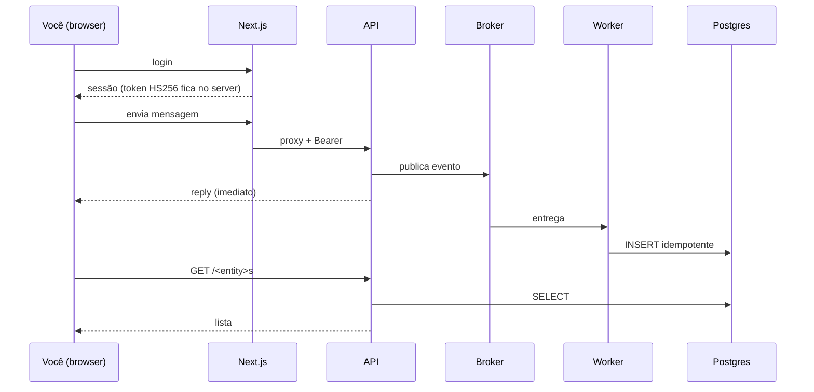

# Começando

> **Estilo Diátaxis — tutorial.** Objetivo: você sobe o stack inteiro com um
> comando e **vê o loop ponta-a-ponta funcionar**. É um caminho feliz para
> *aprender*, não uma referência exaustiva nem um how-to de tarefa específica.
> Domínio neutro: o app expõe um chat/formulário genérico que cria `<Entity>s`.

> Você verá **uma** forma — web + API (proxy same-origin), variante assíncrona; **não é a única** (ver
> [Arquitetura](../explanation/architecture.md) para multi-presentation e o fluxo
> síncrono default).

## Pré-requisitos

- Node.js 22+ e pnpm 10 (`corepack enable`)
- Docker + Docker Compose

> Este modelo é *business-stripped*: a lógica de negócio é trivial de propósito
> (a API ecoa a mensagem). Não há dump de banco externo a obter — tudo sobe a
> partir do compose. Quando você plugar seu domínio, é aqui que documentará
> qualquer pré-requisito de dado.

## Subir tudo com um comando

```bash
cp .env.example .env
docker compose up -d --build --wait
```

- Frontend: <http://localhost:3000> (login de exemplo: `demo@<app>.dev` / `demo1234`)
- Swagger da API: <http://localhost:3001/docs>
- Broker (RabbitMQ): <http://localhost:15672>

Com observabilidade (perfil opcional):

```bash
docker compose -f compose.yaml -f compose.observability.yaml --profile observability up -d --wait
# Grafana: http://localhost:3030
```

Derrubar (use `-v` para apagar os volumes):

```bash
docker compose down
```

## O fluxo DE REFERÊNCIA que você verá

1. **Login** no frontend — o Auth.js emite a sessão (cookie JWE) e, *server-side*,
   um **token HS256** curto para a API. O Bearer **nunca** chega ao browser.
2. **Envio** de uma mensagem → o proxy same-origin `/api/<app>/...` anexa o
   Bearer → a API valida no `JwtAuthGuard`.
3. A API **responde na hora** e **publica um evento durável** no broker — sem
   tocar o banco.
4. O **worker** (mesma imagem, outro entrypoint) consome o evento e faz um
   `INSERT ... ON CONFLICT DO NOTHING` no Postgres.
5. `GET /<entity>s` lê de volta do Postgres — visível no frontend ao atualizar.



## Entendeu o loop? Próximos passos

- **Por que** a API responde antes de persistir (e quando isso é opt-in) →
  [Escrita síncrona — e o opt-in assíncrono](../explanation/sync-and-async-flow.md)
- **Como** as 4 camadas se encaixam →
  [Arquitetura](../explanation/architecture.md)
- **Replicar** este harness num projeto novo →
  [Replicar este harness](../how-to/replicate-this-harness.md)

## Rodar sem containerizar as apps (hot-reload)

Útil para desenvolvimento:

```bash
# 1. infra (postgres, redis, broker)
docker compose up -d postgres redis rabbitmq

# 2. dependências + build dos contratos (OBRIGATÓRIO antes de api/web)
pnpm install
pnpm --filter @app/contracts build

# 3. migrações
pnpm db:migrate

# 4. apps (terminais separados, ou via turbo)
pnpm --filter @app/api dev          # API em :3001
pnpm --filter @app/api worker:dev   # worker
pnpm --filter @app/web dev          # frontend em :3000
```

> **Windows.** O build `output: standalone` do Next exige Developer Mode
> (symlinks). Para validar localmente use `pnpm --filter @app/web dev`; o build
> standalone roda normalmente na imagem Docker (Linux).
